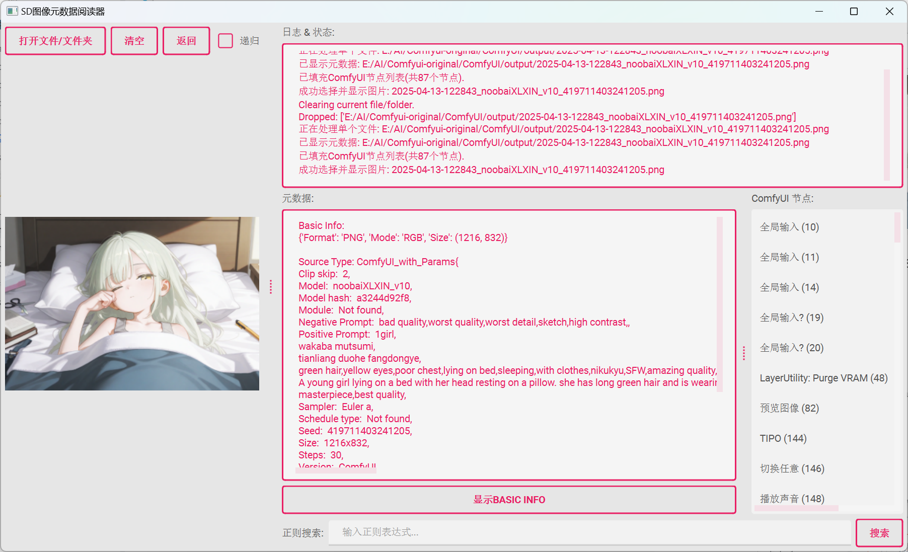

# SD Metadata Reader / SD 图像元数据阅读器

## Demo / 效果展示





## Introduction / 项目简介

  

This is a tool for reading and parsing metadata from images generated by Stable Diffusion (WebUI/ComfyUI) and NovalAI. It can extract key data like generation parameters, prompts, ComfyUI node information, and display them in a structured way.

这是一个用于读取和解析 Stable Diffusion (WebUI/ComfyUI) 和 NovalAI 生成图像的元数据的工具。它可以提取生成参数、提示词、ComfyUI节点信息等关键数据，并以结构化的方式展示。

  

## Features / 功能特点

  

- **Multi-format Support / 多格式支持**: Supports common image formats like PNG, JPG, JPEG, WebP

- **Metadata Parsing / 元数据解析**:

  - Parses WebUI generation parameters (Steps, Sampler, CFG scale, Seed etc.)

  - Extracts positive and negative prompts

  - Parses ComfyUI nodes and workflow information

- **File Handling / 文件处理**:

  - Supports drag-and-drop files/folders

  - Recursively searches subfolders

  - Batch processes multiple files

- **Advanced Features / 高级功能**:

  - Regex search in metadata content

  - Detailed error logging and status feedback

  

## 安装与使用

### 先克隆或者下载本项目

```bash
git clone https://github.com/gasdyueer/sd-metadata-reader.git

# 或者

https://github.com/gasdyueer/sd-metadata-reader/archive/refs/heads/main.zip
```

### 依赖安装

```bash
# 作者使用的是python版本为3.12.5.
pip install -r requirements.txt

```

  

### 运行程序

```bash

python main.py

# 或者直接直接运行dist/main.exe

```

  

### 使用方法


1. 拖放图像文件或文件夹到程序窗口

2. 或点击"打开文件/文件夹"按钮选择

3. 查看右侧解析后的元数据

4. 使用正则搜索功能查找特定内容

  

## 项目结构

```

├── assets/             # 资源文件 (图标等)

├── core/               # 核心功能模块

│   ├── file_handler.py   # 文件处理

│   ├── metadata_parser.py# 元数据解析

│   └── __init__.py

├── ui/                 # 用户界面

│   ├── main_window.py  # 主窗口

│   ├── widgets.py      # 自定义组件

│   └── __init__.py

├── themes/             # UI主题

├── LICENSE             # 许可证

├── main.py             # 程序入口

├── README.md           # 本文件

└── requirements.txt    # 依赖列表

```

  

## 构建与发布

  

使用 PyInstaller 构建可执行文件:

```bash

pyinstaller --onefile --windowed main.py

# 其实是用pyinstaller main.spec打包的,如果有会uv打包的大佬请教教我😭

```

  

## 许可证

  

MIT License
