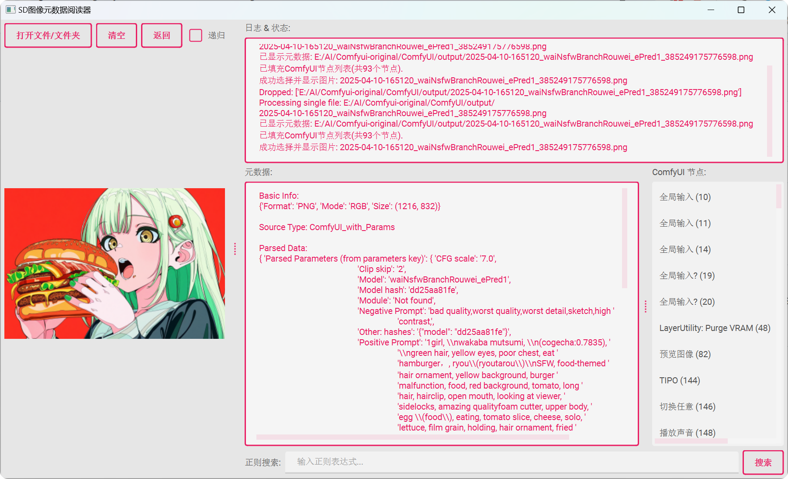

# SD 图像元数据阅读器

## 效果展示





## 项目简介

  

这是一个用于读取和解析 Stable Diffusion (WebUI/ComfyUI) 生成图像的元数据的工具。它可以提取生成参数、提示词、ComfyUI节点信息等关键数据，并以结构化的方式展示。

  

## 功能特点

  

- **多格式支持**: 支持 PNG, JPG, JPEG, WebP 等常见图像格式

- **元数据解析**:

  - 解析 WebUI 生成的参数 (Steps, Sampler, CFG scale, Seed等)

  - 提取正面和负面提示词

  - 解析 ComfyUI 节点和工作流信息

- **文件处理**:

  - 支持拖放文件/文件夹

  - 递归搜索子文件夹

  - 批量处理多个文件

- **高级功能**:

  - 正则表达式搜索元数据内容

  - 详细的错误日志和状态反馈

  

## 安装与使用

### 先克隆或者下载本项目

```bash
git clone https://github.com/gasdyueer/sd-metadata-reader.git

# 或者

https://github.com/gasdyueer/sd-metadata-reader/archive/refs/heads/main.zip
```

### 依赖安装

```bash
# 作者使用的是python版本为3.12.5.
pip install -r requirements.txt

```

  

### 运行程序

```bash

python main.py

# 或者直接直接运行dist/main.exe

```

  

### 使用方法


1. 拖放图像文件或文件夹到程序窗口

2. 或点击"打开文件/文件夹"按钮选择

3. 查看右侧解析后的元数据

4. 使用正则搜索功能查找特定内容

  

## 项目结构

```

├── assets/             # 资源文件 (图标等)

├── core/               # 核心功能模块

│   ├── file_handler.py   # 文件处理

│   ├── metadata_parser.py# 元数据解析

│   └── __init__.py

├── ui/                 # 用户界面

│   ├── main_window.py  # 主窗口

│   ├── widgets.py      # 自定义组件

│   └── __init__.py

├── themes/             # UI主题

├── LICENSE             # 许可证

├── main.py             # 程序入口

├── README.md           # 本文件

└── requirements.txt    # 依赖列表

```

  

## 构建与发布

  

使用 PyInstaller 构建可执行文件:

```bash

pyinstaller --onefile --windowed main.py

# 其实是用pyinstaller main.spec打包的,如果有会uv打包的大佬请教教我😭

```

  

## 许可证

  

MIT License
